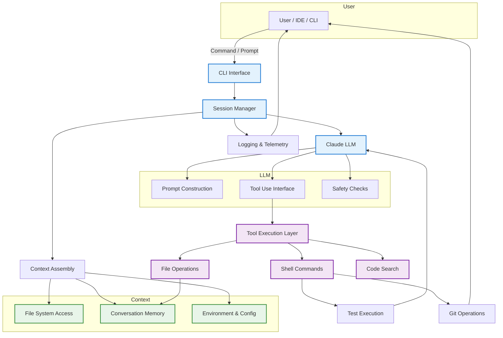

# Claude Code Architecture

Technical architecture documentation for understanding Claude Code's agent-based coding assistant system.

---

## System Overview

Claude Code is an AI-powered coding assistant that combines large language models with tool execution capabilities to perform complex software development tasks. The system operates through a multi-component architecture that enables context-aware code generation, execution, testing, and version control operations.

---

## Core Components

### 1. CLI Interface => tools/terminal.py

Entry point for user interaction via terminal.

**Responsibilities:**
- Parse user commands and arguments
<!--
- Initialize session with configuration
- Handle authentication and permissions
-->
- Display formatted output and progress

**Key Features:**
- Command parsing and validation
- Interactive prompts when needed
- Streaming response display
- Error handling and user feedback

### 2. Session Manager => tools/orchestrator.py

Orchestrates the entire workflow for a single user request.

**Responsibilities:**
- Maintain conversation state across multiple turns
- Coordinate context gathering
- Manage tool execution lifecycle
- Handle errors and retries
- Track usage and costs

**State Management:**
- Conversation history (messages, tool calls, results)
- File system state (working directory, modified files)
- Configuration (model, temperature, token limits)
- Execution context (environment variables, paths)

### 3. Context Assembly => tools/context.py

Gathers relevant information to provide to the LLM.

**Context Sources:**

**File System Access:**
- Read files (with line range support)
- Search files by pattern (glob)
- Search content (grep/regex)
- List directory contents
- File metadata (permissions, timestamps)

**Conversation Memory:**
- Previous messages and responses
- Tool calls and their results
- User feedback and corrections
- Session-specific state

**Environment & Config:**
- Working directory and project structure
- Environment variables
- Git repository state
- Project configuration files (.gitignore, package.json, etc.)
- User preferences and settings

**Context Optimization:**
- Selective file reading (not entire codebase)
- Smart truncation of large outputs
- Relevance-based filtering
- Token budget management

### 4. Claude LLM

The core language model that powers understanding and generation.

**Prompt Construction:**
- System prompts with instructions and capabilities
- Context injection (files, conversation history)
- Tool definitions and usage guidelines
- Safety and policy instructions
- Task-specific formatting rules

**Tool Use Interface:**
- Structured tool call generation
- Parameter validation
- Multi-tool orchestration
- Error handling and recovery

**Safety Checks:**
- Input validation
- Output filtering
- Dangerous operation detection
- Privacy protection (no credential exposure)
- Compliance with usage policies

**Model Capabilities:**
- Code understanding and generation
- Multi-file reasoning
- Test creation and debugging
- Documentation writing
- Refactoring and optimization

### 5. Tool Execution Layer

Executes operations requested by the LLM in a controlled manner.

**Tool Categories:**

**File Operations:**
- `Read`: Read file contents (with offset/limit)
- `Write`: Create or overwrite files
- `Edit`: In-place string replacement
- `Glob`: Pattern-based file search

**Code Search:**
- `Grep`: Content search with regex support
- Context extraction (lines before/after matches)
- Multiple output modes (files, content, counts)

**Shell Commands:**
- `Bash`: Execute shell commands
- Working directory management
- Environment variable support
- Timeout and resource limits
- Output streaming and capture

**Specialized Operations:**
- Git commands (status, diff, commit, push, PR creation)
- Test execution (pytest, jest, etc.)
- Build operations
- Package management

**Safety Mechanisms:**
- Command validation before execution
- Sandboxing (optional, platform-dependent)
- User confirmation for destructive operations
- Timeout enforcement
- Resource limits (CPU, memory, disk)

### 6. Test Execution

Runs tests and provides feedback to the LLM.

**Responsibilities:**
- Execute test suites (unit, integration)
- Capture test output and results
- Parse test failures and errors
- Provide feedback for iteration

**Integration:**
- Supports multiple test frameworks
- Configurable test commands
- Timeout handling
- Coverage reporting (when available)

**Feedback Loop:**
- Failed tests trigger LLM iteration
- Error messages guide corrections
- Success confirmation for validation

### 7. Git Operations

Version control integration for code changes.

**Capabilities:**
- Status and diff checking
- Staging files
- Creating commits with generated messages
- Branch management
- Push to remote
- Pull request creation (via gh CLI)

**Best Practices:**
- Never force push without explicit user request
- Verify commit authorship
- Follow repository commit conventions
- Include context in commit messages
- Respect git hooks

### 8. Logging & Telemetry

Observability and debugging support.

**Logged Information:**
- User commands and prompts
- LLM requests and responses (sanitized)
- Tool calls and results
- Errors and warnings
- Performance metrics (tokens, latency)

**Privacy:**
- Secret redaction
- Optional telemetry
- Local-first logging
- User control over data sharing

---

## Data Flow

### Typical Request Flow

1. **User Input**
   - User enters command via CLI
   - Session initialized with context

2. **Context Gathering**
   - Relevant files identified
   - Conversation history loaded
   - Environment scanned

3. **LLM Processing**
   - Prompt constructed with context
   - Model generates response with tool calls
   - Safety checks applied

4. **Tool Execution**
   - Tools executed in sequence
   - Results captured
   - State updated

5. **Iteration (if needed)**
   - Tool results fed back to LLM
   - LLM adjusts approach
   - Additional tool calls generated

6. **Completion**
   - Final response to user
   - State persisted
   - Session closed or continues

### Multi-Turn Conversations

Claude Code maintains context across multiple interactions:
- Previous messages influence current responses
- File modifications are tracked
- User preferences are remembered within session
- Error corrections improve subsequent attempts

---

## Key Design Principles

### 1. Context Efficiency

**Problem:** Large codebases exceed LLM context windows

**Solution:**
- Selective file reading (only relevant files)
- Smart search (grep/glob before reading)
- Truncation strategies (line limits, summarization)
- User-guided context (explicit file references)

### 2. Safety First

**Problem:** AI could execute dangerous operations

**Solution:**
- Command validation before execution
- User approval for destructive operations (configurable)
- Git safety (no force push, verify authorship)
- Secret scanning
- Sandboxing capabilities

### 3. Iterative Improvement

**Problem:** Initial attempts may fail

**Solution:**
- Test-driven development loop
- Error feedback to LLM
- Multi-turn refinement
- User guidance integration

### 4. Stateful Sessions

**Problem:** Need continuity across interactions

**Solution:**
- Conversation history maintained
- File state tracked
- Configuration persisted
- Resume capability

### 5. Tool Abstraction

**Problem:** LLM needs consistent interface to diverse operations

**Solution:**
- Standardized tool definitions
- Clear parameter schemas
- Predictable result formats
- Error handling conventions

---

## Configuration & Customization

### Environment Variables

Configuration via `.env` or environment:
- Model selection
- Token limits
- Logging levels
- Tool permissions
- Custom tool paths

### User Preferences

Per-user or per-project settings:
- Auto-approval for safe operations
- Preferred testing frameworks
- Commit message conventions
- Code style preferences

### Hooks & Extensions

Extensibility mechanisms:
- Pre/post tool execution hooks
- Custom tool definitions
- MCP (Model Context Protocol) servers
- Slash commands for common operations

---

## Security Considerations

### Input Validation

- Command injection prevention
- Path traversal protection
- Argument sanitization

### Execution Isolation

- Optional sandboxing (containers, VMs)
- Resource limits (CPU, memory, time)
- Network restrictions (configurable)

### Secret Management

- Credential detection and redaction
- No .env file commits without warning
- API key protection
- Telemetry sanitization

### Git Safety

- Verify commit authorship
- Respect git hooks
- No force operations without approval
- Branch protection awareness

---

## Performance Optimization

### Token Efficiency

- Selective context inclusion
- Result truncation
- Streaming responses
- Cache utilization

### Execution Speed

- Parallel tool execution (when safe)
- Command timeouts
- Background operations
- Incremental processing

### Resource Management

- Memory limits for file operations
- Disk space monitoring
- Process cleanup
- Connection pooling

---

## Limitations & Constraints

### Current Limitations

- Context window bounds (even with optimization)
- No persistent project memory (within session only)
- Limited understanding of runtime behavior
- Dependency on external tools (git, test runners)

### Operational Constraints

- Requires file system access
- Needs shell execution permissions
- Git operations require repository context
- Test execution depends on environment setup

### Safety Constraints

- No automatic destructive operations (configurable)
- No force push to main/master
- Limited network access in sandboxed mode
- No execution of untrusted code without review

---

## Future Considerations

### Potential Enhancements

- Persistent project memory (CLAUDE.md equivalent)
- Enhanced RAG for large codebases
- Improved error recovery strategies
- Collaborative multi-agent workflows
- IDE integrations (LSP, extensions)

### Scalability

- Multi-repository support
- Parallel session handling
- Distributed execution
- Cloud-based sandboxing

---

## Implementation Guidelines

For building a similar system:

### Phase 1: Core Loop (MVP)
1. CLI interface with basic parsing
2. Session manager (single-turn)
3. LLM integration with tool use
4. Basic tools (Read, Write, Bash)
5. Simple logging

### Phase 2: Robustness
6. Multi-turn conversations
7. Context optimization
8. Safety checks and validations
9. Git integration
10. Test runner support

### Phase 3: Production
11. Comprehensive error handling
12. Sandboxing and security
13. Performance optimization
14. Telemetry and observability
15. User customization

### Phase 4: Advanced
16. RAG for large codebases
17. Persistent memory system
18. Advanced planning strategies
19. Multi-agent coordination
20. IDE integrations

---

## Technical Stack Reference

**Core Technologies:**
- Language Model: Claude (Anthropic API)
- Runtime: Node.js / Python
- CLI Framework: Commander.js / Click / Typer
- Tool Execution: Child processes, sandboxes
- Version Control: Git CLI, GitHub CLI (gh)

**Key Libraries:**
- File operations: fs/os modules
- Process execution: child_process/subprocess
- Pattern matching: glob, ripgrep
- Configuration: dotenv
- Logging: Custom logger implementations

---

## Glossary

**Agent:** AI system that can perceive environment and take actions to achieve goals

**Tool Use:** LLM capability to generate structured function calls for external operations

**Context Window:** Maximum token limit for LLM input (prompt + conversation history)

**Session:** Single continuous interaction between user and Claude Code

**Tool Call:** Structured request from LLM to execute a specific operation

**Sandbox:** Isolated execution environment with restricted permissions

**MCP:** Model Context Protocol for extending LLM capabilities

---

**Note:** This architecture represents the publicly observable design of Claude Code based on its behavior and documentation. Internal implementation details may vary.
